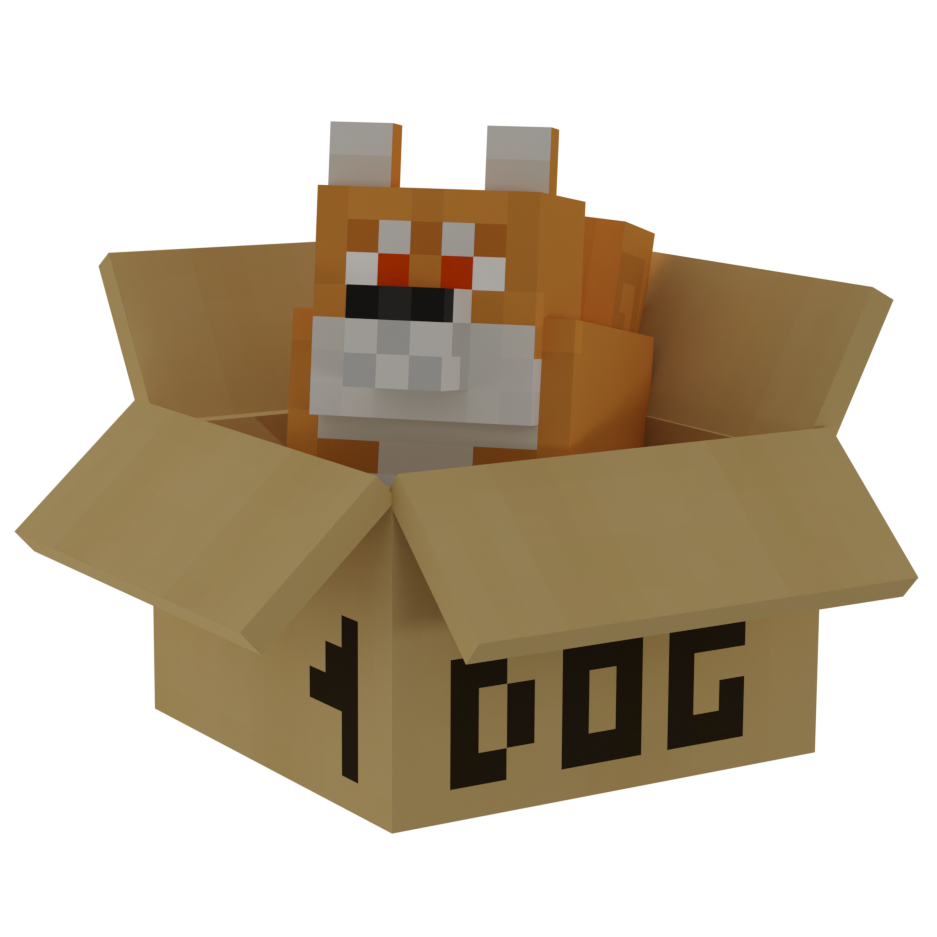

<p align="center"></p>

<h1 align="center">Shiba Box Launcher</h1>

<em><h5 align="center">A fork of Helios (formerly Electron Launcher)</h5></em>

[<p align="center">](https://github.com/Shibabox-eu/ShibaboxLauncher/actions) [](https://github.com/Shibabox-eu/ShibaboxLauncher/releases) </p>

<p align="center">Join modded servers without worrying about installing Java, Forge, or other mods. We'll handle that for you.</p>


## Features

* 🔒 Full account management.
  * Add multiple accounts and easily switch between them.
  * Microsoft (OAuth 2.0) + Mojang (Yggdrasil) authentication fully supported.
  * Credentials are never stored and transmitted directly to Mojang.
* 📂 Efficient asset management.
  * Receive client updates as soon as we release them.
  * Files are validated before launch. Corrupt or incorrect files will be redownloaded.
* ☕ **Automatic Java validation.**
  * If you have an incompatible version of Java installed, we'll install the right one *for you*.
  * You do not need to have Java installed to run the launcher.
* ⚙️ Intuitive settings management, including a Java control panel.
* Supports all of our servers.
  * Switch between server configurations with ease.
  * View the player count of the selected server.
* Automatic updates. That's right, the launcher updates itself.
*  View the status of Mojang's services.

This is not an exhaustive list. Download and install the launcher to gauge all it can do!

#### Need Help? [Check the wiki.][wiki]

#### Like the project? Leave a ⭐ star on the repository!

## Downloads

You can download from [GitHub Releases](https://github.com/Shibabox-eu/ShibaboxLauncher/releases)

#### Latest Release

[](https://github.com/Shibabox-eu/ShibaboxLauncher/releases)

**Supported Platforms**

If you download from the [Releases](https://github.com/Shibabox-eu/ShibaboxLauncher/releases) tab, select the installer for your system.

| Platform | File |
| -------- | ---- |
| Windows x64 | `Shiba-Box-Launcher-setup-VERSION.exe` |
| macOS x64 | `Shiba-Box-Launcher-setup-VERSION-x64.dmg` |
| macOS arm64 | `Shiba-Box-Launcher-setup-VERSION-arm64.dmg` |
| Linux x64 | `Shiba-Box-Launcher-setup-VERSION.AppImage` |

## Console

To open the console, use the following keybind.

```console
ctrl + shift + i
```

Ensure that you have the console tab selected. Do not paste anything into the console unless you are 100% sure of what it will do. Pasting the wrong thing can expose sensitive information.

#### Export Output to a File

If you want to export the console output, simply right click anywhere on the console and click **Save as..**


### Credits

This Launcher is a fork of the amazing [Helios Launcher](https://github.com/dscalzi/HeliosLauncher). We owe a debt of gratitude to their dedicated efforts; without them, our vision wouldn't have been realized!

---

## Resources

* [Wiki][wiki]

The best way to contact the developers is on Discord.

[discord](https://discord.gg/UnfHwWm6Wh)

---

### See you ingame.

[nodejs]: https://nodejs.org/en/ 'Node.js'
[vscode]: https://code.visualstudio.com/ 'Visual Studio Code'
[mainprocess]: https://electronjs.org/docs/tutorial/application-architecture#main-and-renderer-processes 'Main Process'
[rendererprocess]: https://electronjs.org/docs/tutorial/application-architecture#main-and-renderer-processes 'Renderer Process'
[chromedebugger]: https://marketplace.visualstudio.com/items?itemName=msjsdiag.debugger-for-chrome 'Debugger for Chrome'
[discord]: https://discord.gg/zNWUXdt 'Discord'
[wiki]: https://github.com/dscalzi/HeliosLauncher/wiki 'wiki'
[nebula]: https://github.com/dscalzi/Nebula 'dscalzi/Nebula'
[v2branch]: https://github.com/dscalzi/HeliosLauncher/tree/ts-refactor 'v2 branch'
